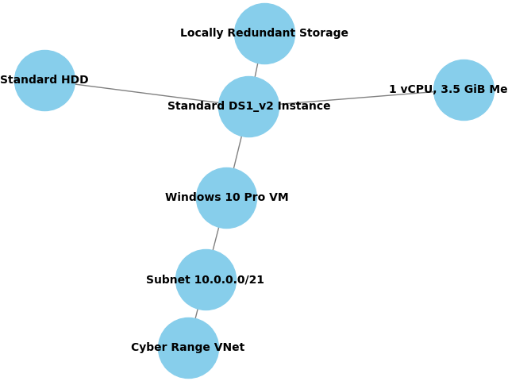

# Cyber Range Vulnerability Assessment using Tenable

## 🔍 Overview
This project documents a vulnerability assessment conducted on a virtual Windows machine using Tenable.io with both authenticated and unauthenticated scans in a controlled cyber range environment.

## 🛠️ Environment Setup
- **Platform**: Virtual Windows 10 Pro
- **Instance Specs**: Standard DS1_v2, 1 vCPU, 3.5 GiB memory, Standard HDD, Locally Redundant Storage (LRS)
- **Network**: Cyber Range VNet with subnet 10.0.0.0/21

- ### Network Architecture Diagram
  

- ## 🎯 Objectives
- Identify and analyze vulnerabilities in a virtual Windows system
- Compare scan results from authenticated vs. unauthenticated scans
- Perform a risk assessment based on NIST SP 800-30 and CVSS scores
- Provide actionable recommendations for mitigation and continuous monitoring

## 🧰 Tools & Technologies
- **Tenable.io / Tenable.sc**
- **Internal Scanner**
- **Windows 10/11 Virtual Machine**
- **National Vulnerability Database (NVD)**
- **NIST Cybersecurity Framework (CSF)**

## 🔍 Scan Methodology
- **Authenticated Scan**: Performed with valid credentials to simulate insider access with credential uuser : 21 minutes 
- **Unauthenticated Scan**: Simulated external attacker with no credentials : 9  minutes
- **Scan Targets**: Virtual Windows machine configured with common services

## 📊 Scan Results Summary
- Target: Virtual Windows 10 Pro machine
- Location: Cyber Range (VNet: 10.0.0.0/21)
- Scan Tools: Tenable.io Internal Scanner
- Scan Types:
-   Unauthenticated Scan: 9 minutes
-   Authenticated Scan: 21 minutes

-   ## Vulnerability Summary

| **Scan Type**       | **Critical** | **High** | **Medium** | **Low** | **Info** | **Total** |
|---------------------|--------------|----------|------------|---------|----------|-----------|
| Unauthenticated     | 0            | 0        | 6          | 1       | 29       | 36        |
| Authenticated       | 0            | 5        | 19         | 3       | 132      | 159       |

### Summary:
- The **authenticated scan** revealed significantly more vulnerabilities, including **5 high-severity** and **19 medium-severity** issues.
- The **unauthenticated scan** detected mostly **surface-level issues**, primarily related to **SSL/TLS** and **SMB configurations**.

# Top Vulnerabilities Comparison

## 🔐 Top 3 Vulnerabilities (Authenticated Scan)

| **Severity** | **Plugin ID** | **Vulnerability Name**                                                                 |
|--------------|----------------|----------------------------------------------------------------------------------------|
| High         | 181297         | Microsoft 3D Viewer app Multiple Remote Code Execution Vulnerabilities (Sep 2023)     |
| High         | 141430         | Microsoft 3D Viewer Base3D Code Execution (Oct 2020)                                  |
| High         | 178245         | Microsoft Paint 3D Code Execution (Jul 2023)                                          |

These are **remote code execution (RCE)** vulnerabilities in Microsoft 3D Viewer and Paint 3D, which could allow attackers to execute arbitrary code on the system.

## 🛡️ Top 3 Vulnerabilities (Unauthenticated Scan)

| **Severity** | **Plugin ID** | **Vulnerability Name**                                           |
|--------------|----------------|------------------------------------------------------------------|
| Medium       | 157288         | TLS Version 1.1 Deprecated Protocol                              |
| Medium       | 42873          | SSL Medium Strength Cipher Suites Supported (SWEET32)           |
| Medium       | 57608          | SMB Signing not required                                        |

These are **configuration and protocol weaknesses** that could expose the system to man-in-the-middle attacks or downgrade attacks.

## 📄 Evidence
-      

 
## 🧠 Risk Assessment
- Based on NIST SP 800-30 and NVD CVSS scores
- Risk levels assigned using Risk Management Hierarchy Tiers

- # Top Vulnerabilities Table

| Vulnerability Name                     | CVSS Score | Severity | Description                                                       | Exploit Exists | Patch Available |
|----------------------------------------|------------|----------|-------------------------------------------------------------------|----------------|-----------------|
| Microsoft 3D Viewer App RCE            | 7.8        | High     | Multiple remote code execution vulnerabilities in 3D Viewer app. | Yes            | Yes             |
| Microsoft Paint 3D Code Execution      | 7.8        | High     | Remote code execution vulnerabilities in Paint 3D app.           | Yes            | Yes             |
| WinVerifyTrust Signature Validation    | 6.8        | Medium   | RCE vulnerability in signature validation process.               | Yes            | Yes             |

 NIST SP 800-30 Rev. 1 – Guide for Conducting Risk Assessments (PDF) 1

Referring to NIST SP 800-30 Guide for condunting Risk Assements the below tables will help :

✅ What's Included:
- Impact to Organisation Table using NIST SP 800-30 Table H-2 and H-3 guidance.
- Table H-2: Identify types of impact (e.g., operational, reputational, financial).
- Table H-3: Determine the magnitude of impact (e.g., low, moderate, high).
- Explanation of Risk Management Hierarchy Tiers (Tiers 1–3).
- 11 RMF Monitor Step Actions summarized in one sentence each.

| Type of Impact   | Impact Affected Asset   | Maximum Impact   | Explanation                                                           |
|:-----------------|:------------------------|:-----------------|:----------------------------------------------------------------------|
| Confidentiality  | Sensitive Data          | High             | Unauthorized access to sensitive data could lead to data breaches.    |
| Integrity        | System Files            | High             | Modification of system files could compromise system integrity.       |
| Availability     | Service Availability    | Medium           | Disruption of services could affect availability but can be restored. |

### Risk Management Hierarchy Tiers
The identified vulnerabilities impact the following Risk Management Hierarchy Tiers:
1. **Tier 1: Organization** - The overall risk to the organization due to potential data breaches.
2. **Tier 2: Mission/Business Process** - The risk to business processes due to compromised system integrity.
3. **Tier 3: Information System** - The risk to specific information systems due to service disruptions.

### RMF Monitor Step Actions
1. **Define** the monitoring strategy.
2. **Establish** monitoring objectives.
3. **Develop** a monitoring plan.
4. **Implement** the monitoring plan.
5. **Collect** monitoring data.
6. **Analyze** monitoring data.
7. **Report** monitoring results.
8. **Respond** to monitoring results.
9. **Review** and update the monitoring strategy.
10. **Integrate** monitoring into the risk management process.
11. **Continuously** improve the monitoring process.

## 🛡️ Recommendations

## 1. Apply Security Controls from NIST SP 800-53 Rev. 5

To mitigate the identified vulnerabilities, implement the following relevant controls:

| **Control ID** | **Control Name**                                      | **Purpose**                                                                 |
|----------------|--------------------------------------------------------|------------------------------------------------------------------------------|
| **SI-02**      | Flaw Remediation                                       | Ensure timely identification and remediation of software flaws.             |
| **SI-03**      | Malicious Code Protection                              | Deploy antivirus and anti-malware tools to detect and prevent RCE attacks.  |
| **AC-03**      | Access Enforcement                                     | Restrict access to sensitive system components to prevent unauthorized use. |
| **CM-02**      | Baseline Configuration                                 | Maintain secure baseline configurations for all systems.                    |
| **RA-05**      | Vulnerability Monitoring and Scanning                  | Continuously scan and assess systems for vulnerabilities.                   |
| **IR-04**      | Incident Handling                                      | Establish procedures for responding to detected security incidents.         |
| **AU-06**      | Audit Review, Analysis, and Reporting                  | Monitor logs for signs of exploitation or abnormal behavior.                |

## 2. Tailor Controls Using NIST SP 800-53B Baselines

Use the **Moderate Baseline** from SP 800-53B for systems handling sensitive but unclassified data. Tailor controls based on:
- System criticality
- Threat environment
- Organizational risk tolerance

## 3. Patch Management and Software Updates
- Apply vendor patches for Microsoft 3D Viewer, Paint 3D, and WinVerifyTrust vulnerabilities.
- Automate patch deployment where feasible to reduce exposure windows.

## 4. Enhance Monitoring and Logging
- Implement continuous monitoring aligned with the RMF Monitor Step.
- Use SIEM tools to detect anomalous behavior and potential exploitation attempts.

## 5. User Awareness and Training
- Educate users on phishing, file handling, and safe software practices.
- Reinforce the importance of not executing untrusted files or macros.

 
